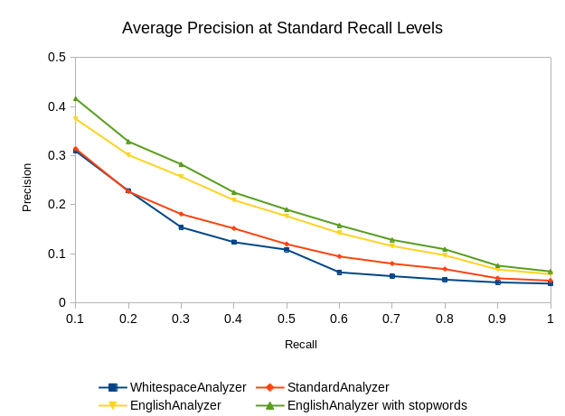

# MAC - Labo 2

Authors :

- Gildas HOULMANN
- Thibaud FRANCHETTI

## Analyzers comparison

### Results

The following graph shows the average precision (AP) at the 11 standard recall values for the 4 analyzers:

- WhitespaceAnalyzer
- StandardAnalyzer
- EnglishAnalyzer
- EnglishAnalyzer using the `common_words.txt` file as a stopwords list

### Discussion

